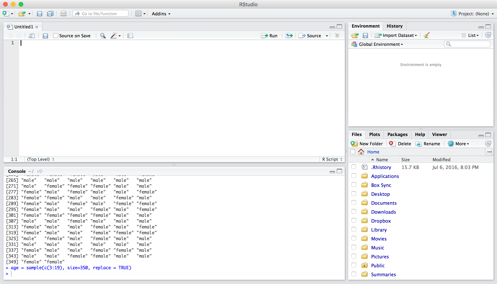
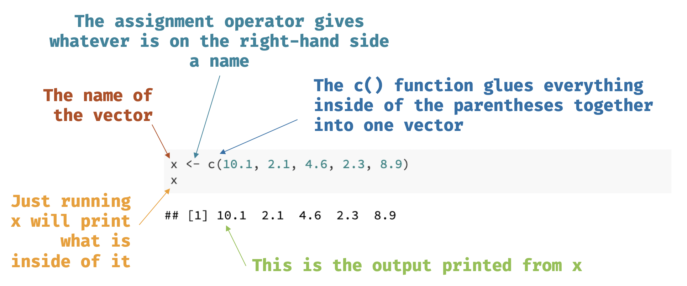
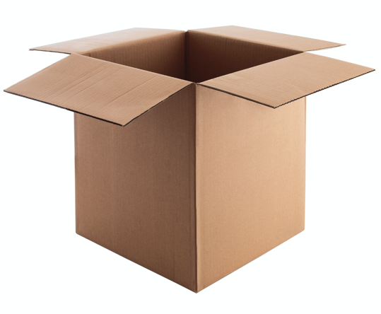

<!--
background-image: Figures/table_forest.jpg
background-position: 90% 50%
background-size: 200px
-->

```{r setup, include=FALSE}
options(htmltools.dir.version = FALSE)
```

class: center, middle, inverse

# Introduction

---
background-image: RStudio_logo.png
background-position: 90% 50%
background-size: 200px

# R and RStudio

.pull-left[
## R is the like the engine in a car

]

--

.pull-right[
## RStudio is the steering wheel and pedals

]

---

## RStudio



---
# Data Types, Objects and More

.huge[
In this chapter we will discuss: 

- .bluer[data types and objects]
- .nicegreen[importing data (and exporting)]
]
--

<br>

.large[
.dcoral[
*These aspects of R, although maybe mundane, are important for:*

1. Data manipulation
2. Modeling
3. Output

]
]

---
class: center, middle, inverse

# Objects

---
## Physical Objects

.pull-left[

.large[
* A .nicegreen[table] is great to eat on, write on, and somewhat good at sitting on. 

* But it is horrible at taking you from Los Angeles to Toronto.
]
]

.pull-right[

]

--

<br>

.large[
- Likewise, objects in `R` are useful for some things and not for others. 

- .bluer[Objects are how we interact with the data, analyze it, and output it.]
]

---

## Virtual Objects

.huge[
We will discuss the most important objects for working with data:

- .bluer[Vectors]

- .dcoral[Data Frames]

]

---
class: center, middle, inverse

# Data Types: Vectors

---
## `numeric`

.large[
`numeric` is a vector with numbers.
]

- It can be whole numbers (i.e. an `integer`) or 
- any real number (i.e. `double`). 

--

Below is a `double`.
```{r numeric1, echo = TRUE}
x <- c(10.1, 2.1, 4.6, 2.3, 8.9)
x
```


---
## `numeric`

.large[
*A quick note about syntax on the last slide:*
]



---
## `character`

.large[
A `character` vector is essentially just letters or words.
```{r char1, echo = TRUE}
ch <- c("I think this is great.", 
        "I would suggest you learn R.", 
        "You seem quite smart.")
ch
```
]

---
## `factor`

A `factor` is a special vector in `R` for categorical variables. It is actually stored as numbers but we can give it labels.
```{r factor1, echo = TRUE}
race <- c(1, 3, 2, 1, 1, 2, 1, 3, 4, 2)
race <- factor(race, 
               labels = c("white", "black", 
                          "hispanic", "asian"))
race
```

*Note that before we used the `factor()` function, the race object was just `numeric`. Once we told it was a "factor" `R` treats it as categorical.*

---
class: center, middle, inverse

# Data Types: Data Frames and Lists

---
## Data Frames

.large[
The `data.frame` is the most important data type for most projects.
]

```{r}
df <- data.frame(x, race)
df
```

Note: We can do quite a bit with the `data.frame` that we called `df`. (Once again, we could have called it anything, although I recommend short names.) 

---
## Data Frames

.large[
There are .bluer[a couple ways of reaching into the data frame] and grabbing just one of the variables

```{r}
df$x
```

In the above code, the .nicegreen[`$`] reaches into `df` to grab the `x` variable (i.e. column). 

The following code does the exact same thing:

```{r, eval=FALSE}
df[["x"]]
df[, "x"]
```
]

.small[*There are actually very small differences but its not too important here.*]

---
## Data Frames

.large[
On the previous slide:

- `df[["x"]]` grabs the `x` variable just like `df$x`. The last example shows that we can grab both columns and rows. 

- In `df[, "x"]` we have a spot just a head of the comma. It works like this: `df[rows, columns]`.
]

--

```{r, eval=FALSE}
df[1:3, "x"]
df[1:3, 1]
```

.large[
- Both lines of the above code grabs rows 1 thorugh 3 and column "x".

- .dcoral[We will learn another (more intuitive) way of doing this.]
]

---
## Some Built-In Functions for Data Frames

.pull-left[
*Get the names of the variables:*
```{r}
names(df)
```

*Know what type of variable it is:*
```{r}
class(df$x)
```

*See the data in a popup window:*
```{r, eval=FALSE}
View(df)
```
]

.pull-right[
*Get the first 10 columns of your data:*
```{r}
head(df, n=10)
```
]

---
class: center, middle, inverse
# Importing Data

---

## Import, Don't Input

.large[
- Most of the time .bluer[you'll want to import data] into `R` rather than manually entering it line by line, variable by variable.

- There are some built in ways to import many .nicegreen[delimited] data types:
  - comma delimited--also called a CSV
  - tab delimited
  - space delimited

- Other .dcoral[**packages**] have been developed to help with this as well. 
    - A package is an extension to `R` that gives you more functions--abilities--to work with data. 
    - Anyone can write a package, although to get it on the Comprehensive R Archive Network (CRAN) it needs to be vetted to a large degree. 
]

---
## Important Note about Importing

.huge[
.dcoral[IMPORTANT:] When you import data into R, .nicegreen[*it does not do anything to the data file*] (unless you ask it to). 

- So, you can play around with it in R, change its shape, subset it, and whatever else you'd like without destroying or even modifying the original data.
]

*Note that the slides that discuss **exporting data** show you how you can override (not recommended) or save additional data files.*

---
## Important Note About Packages

.pull-left[
.large[
.bluer[Packages] are just like .nicegreen[boxes].
]

<br>

When we install it, it is like having the box delivered to our house. But to use the stuff inside, we need to open it. We open it one of two ways:

- `library(packagename)` will dump out all the contents so you can use any of them for that R session

- `packagename::functionname()` will just grab the single thing out
]

.pull-right[

]

---
## Importing Data

We will use the package `rio` for our importing needs.

Most delimited files are saved as `.csv`, `.txt`, or `.dat`.

.pull-left[
```{r, eval=FALSE}
library(rio)
## for csv
df <- import("file.csv")
## for tab delimited
df <- import("file.txt")
## for space delimited
df <- import("file.txt")
```

]

.pull-right[
```{r, eval=FALSE}
## for SPSS data
df <- import("file.sav")
## for Stata data
df <- import("file.dta")
## for this type of SAS file
df <- import("file.xpt")
```

]

--

<br>

.center[.large[Seeing a pattern at all?]]

---
class: center, middle, inverse
# Exporting Data

---
## Exporting Data

.large[
Finally, there are many ways to export data. Most of the `rio` has an `export()` function.
]

```{r, eval=FALSE}
## to create a CSV data file
export(df, file = "file.csv")
```

---

## Help Menu in R

.large[
If you ever have questions about the specific arguments that a certain function has, you can simply run:

```{r, eval=FALSE}
?functionname
```

- So, if you were curious about the different arguments in `export` simply run: `?export`. 

- In the pane with the files, plots, packages, etc. a document will show up to give you more informaton.
]

---
class: center, middle, inverse
# Conclusions


