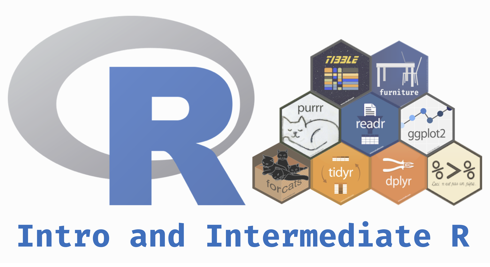

```{r setup, include=FALSE}
knitr::opts_chunk$set(echo = TRUE, comment="")
```

# Introduction

## The Newest and Brightest




---

# The Newest and Brightest
### Tidyverse

.pull-left[
* In order to manipulate your data in the cleanest, most up-to-date manner, we are going to be using the "tidyverse" group of methods. 
* The tidyverse is a group of packages that provide a simple syntax that can do many basic (and complex) data manipulating. 
* The group of packages can be downloaded in the packages panel
]

.pull-right[

After downloading it, simply use:
```{r}
library(tidyverse)
```
to unload all the functions!

]

---

# Tidyverse

Note that when we loaded `tidyverse` it loaded 6 packages and told you of "conflicts". These conflicts are where two or more loaded packages have the same function in them. The last loaded package is the one that `R` will use by default. For example, if we loaded two packages--`awesome` and `amazing`--and both had the function--`make_really_great` and we loaded `awesome` and then `amazing` as so:

```{r, eval=FALSE}
library(awesome)
library(amazing)
```

`R` will automatically use the function from `amazing`. 

---

# Conflicts

We can still access the `awesome` version of the function (because even though the name is the same, they won't necessarily do the same things for you). We can do this by:

```{r, eval=FALSE}
awesome::make_really_great(arg)
```

That's a bit of an aside, but know that you can always get at a function even if it is "masked" from your current session.

---

# Tidy Methods

.pull-left[
## The Tidy Data Way

I'm introducing this to you for a couple reasons.

1. It simplifies the code and makes the code more readable. As Mr. Wickham says, **there are always at least two collaborators on any project: you and future you.**
2. It is the cutting edge. The most influential individuals in the `R` world, including the makers and maintainers of `RStudio`, use these methods and syntax.

The majority of what you'll need to do with data as a researcher will be covered by these functions. 
]

.pull-right[
## Methods for Tidying
There are several methods that help tidy up your data:

1. Piping
2. Selecting and Filtering
3. Grouping and Summarizing
4. Reshaping
5. Joining (merging)

To help illustrate each aspect, we are going to use real data from the National Health and Nutrition Examiniation Survey (NHANES). I've provided this data [on my website](https://tysonstanley.github.io/assets/Data/NHANES.zip). I've cleaned it up somewhat already.
]

---

# Example: NHANES

## Import

```{r}
library(rio)
dem_df <- import("Data/NHANES_demographics_11.xpt")
med_df <- import("Data/NHANES_MedHeath_11.xpt")
men_df <- import("Data/NHANES_MentHealth_11.xpt")
act_df <- import("Data/NHANES_PhysActivity_11.xpt")
```

## Example: NHANES

Now we have four separate, but related, data sets in memory:

1. `dem_df` containing demographic information
2. `med_df` containing medical health information
3. `men_df` containing mental health information
4. `act_df` containing activity level information

---

# Example: NHANES

Since all of them have all-cap variable names, we are going to quickly change this with a little trick:

```{r}
names(dem_df) <- tolower(names(dem_df))
names(med_df) <- tolower(names(med_df))
names(men_df) <- tolower(names(men_df))
names(act_df) <- tolower(names(act_df))
```
This takes the names of the data frame (on the right hand side), changes them to lower case and then reassigns them to the names of the data frame.[^names]

Note that these are not particularly helpful names, but they are the names provided in the original data source. If you have questions about the data, visit [here](http://wwwn.cdc.gov/Nchs/Nhanes/Search/Nhanes11_12.aspx).

---

# Example: NHANES
### We will now go through each aspect of the tidy way of working with data using these four data sets.

---

#  Piping

.pull-left[

]

.pull-right[
```{r, eval=FALSE}
me %>% 
  wake_up("8:00am") %>% 
  exercise(30, units = "minutes") %>% 
  shower(15, units = "minutes") %>% 
  eat_breakfast("toast") %>% 
  go_to_work("basement")
```
]

---

# Example: NHANES
### Piping

`%>%` is the pipe "operator". It takes what is on the left hand side and puts it in the right hand side's function.

```{r, eval=FALSE}
dem_df %>% summary()
```

So the above code takes the data frame `df` and puts it into the `summary` function. This does the same thing as `summary(dem_df)`. 

In this simple case, it doesn't really make the code more readable, but in more complex situations it can really help.

---

# Select and Filter

.pull-left[

]

.pull-right[
In situations where you want or need to subset your data, two main forms exist:

1. **Selecting Variables**
2. **Filtering Rows**
]

---

# Example: NHANES
### Select and Filter

**Selecting Variables**
```{r, eval=FALSE}
df[, c("var1", "var2")]
df %>%
  select(var1, var2)
```

Here both do the same thing. The first, using `[`, is the "base R" way of selecting variables. The second, using the pipe, is the tidyverse way. Both work great so the choice is yours.

---

# Example: NHANES
### Select and Filter

**Filtering Rows**
```{r, eval=FALSE}
df[df$var1 == 1, ]
df %>%
  filter(var1 == 1)
```

Again, both do the same thing. The first, using `[`, is the "base R" way of filtering rows so that you only keep the ones where "var1" in `df` is equal to `1`. Again, the second is the tidyverse way. Whichever you like you should use.

---

# Mutating Variables

Anytime you see `mutate()` it means you are adding a new variable or modifying an existing one.

```{r, eval=FALSE}
data %>% 
  mutate(new_var = do_something_function(old_var))
```

```{r, eval=FALSE}
data <- data %>% 
  mutate(new_var = do_something_function(old_var))
```


---
# Example: NHANES
### Mutating

```{r}
## Our Grouping Variable as a factor
dem_df <- dem_df %>%
  mutate(citizen = factor(dmdcitzn))
```

---

# Grouping and Summarizing

A major aspect of analysis is comparing groups. Lucky for us, this is very simple in `R`. I call it the three step summary:

1. Data
2. Group by
3. Summarize

---

# Example: NHANES
### Grouping and Summarizing

```{r}
dem_df$citizen <- factor(dem_df$dmdcitzn)
dem_df %>%                           ## 1. Data
  group_by(citizen) %>%              ## 2. Group by
  summarize(N = n())                 ## 3. Summarize
```

---

# Example: NHANES
### Grouping and Summarizing

On the previous slide: 

* The first column is the grouping variable and the second is the N (number of individuals) by group. 
* We can quickly see that there are four levels, currently, to the citizen variable. 
    * After some reading of the documentation we see that `1 = Citizen` and `2 = Not a Citizen`. 
    * A value of `7` it turns out is a placeholder value for missing. 
    * And finally we have an NA category. 
        * It's unlikely that we want those to be included in any analyses, unless we are particularly interested in the missingness on this variable. 
        * So let's do some simple cleaning to get this where we want it. To do this, we will use the `furniture` package.

---

# Example: NHANES
### Grouping and Summarizing


```{r, message=FALSE, warning=FALSE}
library(furniture)

dem_df <- dem_df %>% 
  ## Changes all 7's to NA's
  mutate(citizen = washer(citizen, 7)) %>% 
  ## Changes all 2's to 0's
  mutate(citizen = washer(citizen, 2, value=0))
```

Now, our citizen variable is cleaned, with `0` meaning not a citizen and `1` meaning citizen. Let's rerun the code from above with the three step summary:

---

# Example: NHANES
### Grouping and Summarizing

```{r}
## Three step summary:
dem_df %>%                           ## 1. Data
  group_by(citizen) %>%              ## 2. Group by
  summarize(N = n())                 ## 3. Summarize
```

Its clear that the majority of the subjects are citizens.

---

# Example: NHANES
### Grouping and Summarizing

*Check multiple variables at the same time:*

```{r}
## Three step summary:
dem_df %>%                           ## 1. Data
  group_by(citizen) %>%              ## 2. Group by
  summarize(N = n(),                 ## 3. Summarize
            Age = mean(ridageyr, na.rm=TRUE))                 
```

---

# Example: NHANES
### Grouping and Summarizing

On previous slide:

* The `n()` function gives us counts
* The `mean()` function which, shockingly, gives us the mean. 
    * Note that if there are `NA`'s in the variable, the mean (and most other functions like it) will give the result `NA`. 
    * To have `R` ignore these, we tell the `mean` function to remove the `NA`'s when you compute this using `na.rm=TRUE`.

---

# Example: NHANES
### Reshaping ("Pivoting")

This is a big part of working with data. Unfortunately, it is also a difficult topic to understand without much practice at it. In general, two data formats exist:

1. Wide form
2. Long form

Only when the data is cross-sectional and each individual is a row does this distinction not matter much. Otherwise, if there are multiple measures per individual, or there are multiple individuals per cluster, the distinction between wide and long is very important for modeling and visualization.

---

## Example: NHANES
### Wide Form

Wide form generally has one unit (i.e. individual) per row. This generally looks like:

```{r, echo=FALSE}
data.frame("ID"=c(1:10), "Var_Time1"=rnorm(10), "Var_Time2"=runif(10))
```

Notice that each row has a unique ID. 

.small[
This format is common in the ANOVA family of analyses. These can be used when there are set time points that the individual is measured and each individual has the same number of time points. This is not always reasonable, but when it is, wide format works just fine. However, when these conditions don't hold, mixed effects modeling (i.e. multilevel modeling, hierarchical linear modeling) is particularly useful. In order to do mixed effects modeling, long format is required.
]

---

# Example: NHANES
### Long Form

In contrast, long format has the lowest nested unit as a single row. This means that a single ID can span multiple rows, usually with a unique time point for each row as so:

```{r, echo=FALSE}
data.frame("ID"=c(1,1,1,1,2,2,3,3,3), 
           "Time"=c(1,2,3,4,1,2,1,2,3), 
           "Var"=runif(9))
```

Notice that a single ID spans multiple columns and that each row has only one time point. Here, time is nested within individuals making it the lowest unit. Therefore, each row corresponds to a single time point. Generally, this is the format we want for most modeling techniques and most visualizations.

---

# Quick Sidetrack from NHANES: Reshaping
### Wide to Long

With a fake data set, we'll go from wide to long...
```{r}
df_wide <- data.frame("ID"=c(1:10), 
                      "Var_Time1"=rnorm(10), 
                      "Var_Time2"=runif(10))
df_long <- pivot_longer(df_wide, 
                        cols = Var_Time1:Var_Time2, 
                        names_to = "time",
                        values_to = "value")
df_long
```


---

# Quick Sidetrack from NHANES: Reshaping
### Long to Wide

Now we will go from long to wide using `spread()` from the same package.
```{r}
df_wide <- pivot_wider(df_long, names_from = time, values_from = value)
df_wide
```


---

# Joining (merging)

*The final topic in the chapter is joining data sets.*

We currently have 4 data sets that have mostly the same people in them but with different variables. One tells us about the demographics; another gives us information on mental health. We may have questions that ask whether a demographic characteristics is related to a mental health factor. This means we need to merge, or join, our data sets.

Note that this is different than adding new rows but not new variables. Merging requires that we have at least some overlap of individuals in both data sets.

---

# Joining (merging)

When we merge a data set, we combine them based on some ID variable(s). Here, this is simple since each individual is given a unique identifier in the variable `seqn`. Within the `dplyr` package there are four main joining functions: `inner_join`, `left_join`, `right_join` and `full_join`. Each join combines the data in slightly different ways. 

---

## Example: NHANES
### Joining (merging)
#### Inner Join

Here, only those individuals that are in both data sets that you are combining will remain. So if person "A" is in data set 1 and not in data set 2 then he/she will not be included.

```{r, eval=FALSE}
inner_join(df1, df2, by="IDvariable")
```

---

# Example: NHANES
### Joining (merging)
#### Left or Right Join

This is similar to inner join but now if the individual is in data set 1 then `left_join` will keep them even if they aren't in data set 2. `right_join` means if they are in data set 2 then they will be kept whether or not they are in data set 1.

```{r, eval=FALSE}
left_join(df1, df2, by="IDvariable")   ## keeps all in df1
right_join(df1, df2, by="IDvariable")  ## keeps all in df2
```

---

# Example: NHANES
### Joining (merging)
#### Full Join

This one simply keeps all individuals that are in either data set 1 or data set 2. 

```{r, eval=FALSE}
full_join(df1, df2, by="IDvariable")
```

Each of the left, right and full joins will have missing values placed in the variables where that individual wasn't found. For example, if person "A" was not in df2, then in a full join they would have missing values in the df1 variables.

---

# Example: NHANES

For our NHANES example, we will use `full_join` to get all the data sets together. Note that in the code below we do all the joining in the same overall step. 

```{r}
df <- dem_df %>%
  full_join(med_df, by="seqn") %>%
  full_join(men_df, by="seqn") %>%
  full_join(act_df, by="seqn")
```

So now `df` is the the joined data set of all four. We started with `dem_df` joined it with `med_df` by `seqn` then joined that joined data set with `men_df` by `seqn`, and so on.


---

# Conclusions

## In This Chapter:
* You have learned how to manipulate your data in several ways:
    * Summarizing
    * Reshaping
    * Joining

*For analyses in the later chapters, we will use this new* `df` *object that we concluded with containing NHANES data.*

Also, you'll see that many of these methods apply to more than just manipulating data. As you learn one method, you'll begin to see how easily you can use it in other situations.

---


