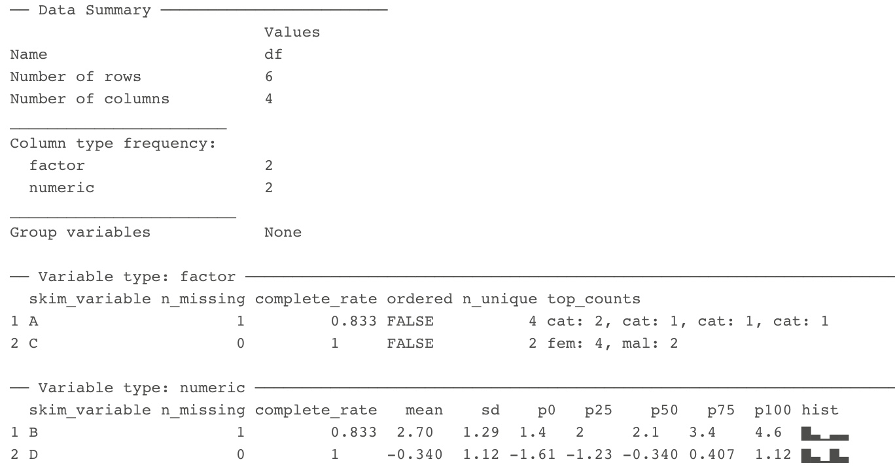

```{r setup, include=FALSE}
knitr::opts_chunk$set(echo = TRUE, comment="", warning=FALSE, message=FALSE, fig.height = 4, fig.width = 5)
library(tidyverse)
```

# Introduction

## Understanding and Describing Your Data

We are going to take what we've learned from the previous two chapters and use them together to have simple but powerful ways to understand your data. This chapter will be broken down into:

1. Descriptive Statistics
2. Visualizations

The two go hand-in-hand in understanding what is happening in your data. 

---

# Exploring Data

We are often most interested in three things when exploring our data: 

1. **understanding distributions**, 
2. **understanding relationships**, and 
3. **looking for outliers or errors**.

---

# Descriptive Statistics

Several methods of discovering descriptives in a succinct way have been developed for `R`. 

* My favorite (full disclosure: it is one that I made so I may be biased) is the `table1()` function in the `furniture` package.
* It has been designed to be simple and complete. 
* It produces a well-formatted table that you can easily export and use as a table in a report or article.[^tab1]

[^tab1]: It is called "table1" because a nice descriptive table is often found in the first table of many academic papers.

---

# Table 1

We'll use a fake data set and we'll show the basic build of the `table1()` function. This can quickly give you means and standard deviations (or counts and percentages for categorical variables).

```{r, echo=FALSE, message=FALSE, warning=FALSE}
library(furniture)
df <- data.frame("A"=rep(c(1,2,1,4,3,NA), times = 5),
                 "B"=rep(c(1.4,2.1,4.6,2.0,NA,3.4), each = 5),
                 "C"=rep(c(0,0,1,1,1,1), each = 5),
                 "D"=rnorm(30))
df$A <- factor(df$A, labels=c("cat1", "cat2", "cat3", "cat4"))
df$C <- factor(df$C, labels=c("male", "female"))
```

---

# Table 1

Then we can use `table1()` by piping our fake data into the `table1()` function and then listing the variables we want summarized.

```{r, message=FALSE, warning=FALSE}
df %>% 
  table1(A, B, C, D)
```

---

# Table 1

So now we see the counts and percentages for the factor variables. But now we can take a step further and look for relationships. The code below shows the means/standard devaitions or counts/percentages by a grouping variable--in this case, `C`.

```{r, message=FALSE, warning=FALSE}
df %>% 
  group_by(C) %>% 
  table1(A, B, D)
```

---

# Table 1

We can also test for differences by group as well (although this is not particularly good with a sample size of 5). It produces a warning since the $\chi^2$ approximation is not accurate with cells this small.

```{r, message=FALSE, warning=FALSE}
df %>% 
  group_by(C) %>% 
  table1(A, B, D,
         test = TRUE)
```

---

# Table 1

Finally, we can play around with the formatting a bit to match what we need:

```{r, message=FALSE, warning=FALSE}
df %>% 
  group_by(C) %>% 
  table1(A, B, D,
         test = TRUE,
         type = c("simple", "condense"))
```

---

# Table 1

So with three or four short lines of code we can get a good idea about variables that may be related to the grouping variable and any missingness in the factor variables. There's much more you can do with `table1` and there are vignettes and tutorials available to learn more.[^tutorials]

[^tutorials]: [tysonstanley.github.io](tysonstanley.github.io)

---

# Other Descriptive Functions

Other quick descriptive functions exist; here are a few of them.
```{r}
library(psych)       ## install first
describe(df)         ## produces summary statistics for continuous variables
```

---

# Other Descriptive Functions

Other quick descriptive functions exist; here are a few of them.

```{r, eval=FALSE}
library(skimr)
skim(df)
```



---

# Visualizations

Understanding your data, in my experience, generally requires visualizations. 

Can help us:

* understand the distributions and relationships
* catch errors in the data
* find any outliers that could be highly influencing any models

---

# Base plotting

A few functions that are helpful to get a quick plot (without really worrying about how it looks).

```{r}
hist(df$B)       # histogram
```

---

# Base plotting

```{r}
plot(df$D, df$B) # scatterplot
```

---

# `ggplot2`

For simple but appealing visualizations we are going to be using `ggplot2`. 

> This package is used to produce professional level plots for many journalism organizations (e.g. five-thrity-eight). These plots are quickly presentation quality and can be used to impress your boss, your advisor, or your friends.

---

# `ggplot2`

This package has a straight-forward syntax. It is built by adding layers to the plot. 

```{r}
library(ggplot2)   ## first install it :)
```

---

# `ggplot2`

It will work using a few steps:

1. Create blank canvas 
2. Select aesthetics
3. Add layers
4. (optional) adjust themes and overall appearance

---

# `ggplot2`

Below, we start with telling `ggplot` the basics of the plot and then build a boxplot. The x-axis is the variable "C" and the y-axis is the variable "D" and then we color it by variable "C" as well.

```{r}
df %>% 
  ggplot() +        # blank canvas
  aes(x = C,        # select aesthetics
      y = D, 
      color = C) +  
  geom_boxplot()    # add layer
```

---

# `ggplot2`

Here are a few more examples:

```{r}
df %>% 
  ggplot() +
  aes(x = C) + 
  geom_bar()
```

---

# `ggplot2`

```{r}
df %>% 
  ggplot() +
  aes(x = B, 
      y = D,
      color = C) +
  geom_point()
```
*Note that the warning that says it removed a row is because we had a missing value in "C".*

---

# `ggplot2`

We are going to make the first one again but with some aesthetic adjustments. Notice that we just added two extra lines telling `ggplot2` how we want some things to look.[^look] 

[^look]: This is just scratching the surface of what we can change in the plots.

---

# A final example

```{r}
df %>% 
  ggplot() +        
  aes(x = C,        
      y = D, 
      color = C) + 
  geom_boxplot() +
  geom_jitter() +
  theme_bw() +
  scale_color_manual(values = c("dodgerblue4", "coral2"))
```

---

# A final example

* We put jittered points on top of the boxplot
* `theme_bw()` makes the background white, 
* the `scale_color_manual()` allows us to change the colors in the plot. 

You can get a good idea of how many types of plots you can do by going to [http://docs.ggplot2.org/current][ggplot2]. 

Almost any informative plot that you need to do as a researcher is possible with `ggplot2`.

[ggplot2]: http://docs.ggplot2.org/current/

We will be using `ggplot2` extensively in the class to help understand our data and our models as well as communicate our results.

